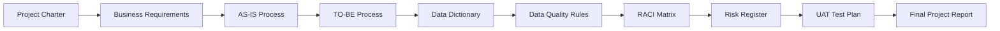

# Project 01 – Master Data Governance for Manufacturing

## Overview

This project demonstrates the role of a Business Analyst and Project Management Specialist in designing a Master Data Governance framework for a manufacturing organization operating within an SAP S/4HANA environment.

The project follows a structured business analysis approach, beginning with project initiation and business requirements gathering, progressing through process analysis and governance design, and concluding with risk management, user acceptance testing, and project closure.

---

## Project Objectives

- Standardize master data management processes.
- Improve master data quality and consistency.
- Define governance roles and responsibilities.
- Reduce duplicate and incomplete master data.
- Support efficient business processes.
- Establish a framework suitable for enterprise implementation.

---

## Project Deliverables

| Document ID | Deliverable | Status |
|-------------|-------------|:------:|
| MDG-P01-001 | Project Charter | ✅ |
| MDG-P01-002 | Business Requirements | ✅ |
| MDG-P01-003 | AS-IS Process Analysis | ✅ |
| MDG-P01-004 | TO-BE Process Analysis | ✅ |
| MDG-P01-005 | Data Dictionary | ✅ |
| MDG-P01-006 | Data Quality Rules | ✅ |
| MDG-P01-007 | RACI Matrix | ✅ |
| MDG-P01-008 | Risk Register | ✅ |
| MDG-P01-009 | User Acceptance Testing (UAT) Test Plan | ✅ |
| MDG-P01-010 | Final Project Report | ✅ |

---

## Skills Demonstrated

- Business Analysis
- Business Process Analysis
- Business Process Improvement
- Master Data Governance
- SAP S/4HANA Concepts
- Requirements Engineering
- Data Quality Management
- Risk Management
- User Acceptance Testing (UAT)
- Stakeholder Management
- Project Documentation

---

## Process Flow



---

## Repository Structure


```text
Business_Analysis_Data_Management_Portfolio
│
├── README.md
├── 01_Master_Data_Governance
│   ├── README.md
│   └── docs
│       ├── MDG-P01-001_Project_Charter.md
│       ├── MDG-P01-002_Business_Requirements.md
│       ├── MDG-P01-003_AS-IS_Process.md
│       ├── MDG-P01-004_TO-BE_Process.md
│       ├── MDG-P01-005_Data_Dictionary.md
│       ├── MDG-P01-006_Data_Quality_Rules.md
│       ├── MDG-P01-007_RACI_Matrix.md
│       ├── MDG-P01-008_Risk_Register.md
│       ├── MDG-P01-009_UAT_Test_Plan.md
│       └── MDG-P01-010_Final_Project_Report.md
```


## Technologies and Standards

- Markdown
- Git
- GitHub
- Mermaid Diagrams
- SAP S/4HANA (Conceptual)
- Master Data Governance (MDG)

---

## Project Status

**Status:** ✅ Complete

This project forms part of the **Business Analysis & Data Management Portfolio**, demonstrating enterprise style documentation, governance, and process improvement practices commonly used in manufacturing and engineering organizations.