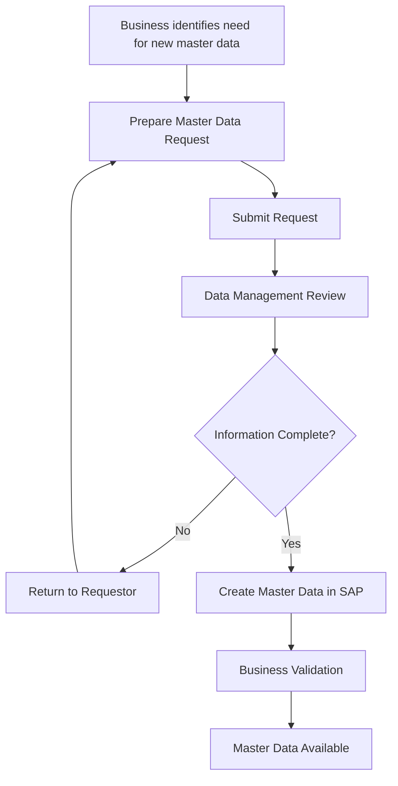

| Document Information | |
|----------------------|------------------------------|
| **Document ID** | MDG-P01-003 |
| **Document Title** | AS-IS Process Analysis |
| **Version** | 1.0 |
| **Status** | Approved |
| **Author** | Emeka Chijioke |
| **Project** | Master Data Governance for Manufacturing |
| **Last Updated** | August 2026 |

---

# AS-IS Process Analysis

## 1. Purpose

This document describes the current (AS-IS) master data creation and management process used in a manufacturing organization. The objective is to understand how master data is currently created, reviewed, approved, and maintained before proposing process improvements.

---

## 2. Process Overview

The existing process is primarily manual and involves multiple departments. Communication is performed through emails, spreadsheets, and ERP transactions. Limited validation and inconsistent approval practices often result in duplicate records, missing information, and delays.

---

## 3. Process Participants

| Role | Responsibility |
|------|----------------|
| Engineering | Creates new product master data requests |
| Procurement | Creates supplier and material data requests |
| Production Planning | Validates planning-related information |
| Quality | Reviews data compliance |
| Data Management Team | Reviews and approves master data |
| IT / SAP Team | Maintains ERP system and user access |

---

## 4. Current Process Steps

| Step | Activity | Owner |
|-----:|----------|-------|
| 1 | Business identifies the need for new master data | Business User |
| 2 | Master data request is prepared manually | Requestor |
| 3 | Request is submitted to the Data Management Team | Requestor |
| 4 | Data completeness is checked | Data Management |
| 5 | Missing information is returned to the requestor | Data Management |
| 6 | Master data is created in SAP | Data Management |
| 7 | Business validates the created record | Business User |
| 8 | Record becomes available for operational use | All Departments |

---

## 5. Current Pain Points

- Duplicate master data records.
- Incomplete request forms.
- Manual approval process.
- Lack of standardized naming conventions.
- Delays caused by email communication.
- Limited visibility of request status.
- Inconsistent data quality across departments.

---

## 6. Process Inputs

- Material information
- Product information
- Supplier information
- Engineering documentation
- Business request

---

## 7. Process Outputs

- Approved master data
- Updated SAP records
- Validated business information
- Audit trail
- Master data available for business operations

---

## 8. Improvement Opportunities

- Introduce standardized request forms.
- Automate validation of mandatory fields.
- Implement workflow-based approvals.
- Apply data quality rules before record creation.
- Improve reporting and process monitoring.

---

## 9. Conclusion

The current process relies heavily on manual activities and cross-functional communication, increasing the risk of inconsistent and duplicate master data. These findings provide the baseline for designing the improved TO-BE process described in the next document.

---

# Appendix A – AS-IS Process Flow

## Related Documents

- MDG-P01-001 – Project Charter
- MDG-P01-002 – Business Requirements
- MDG-P01-004 – TO-BE Process Analysis
- MDG-P01-010 – Final Project Report