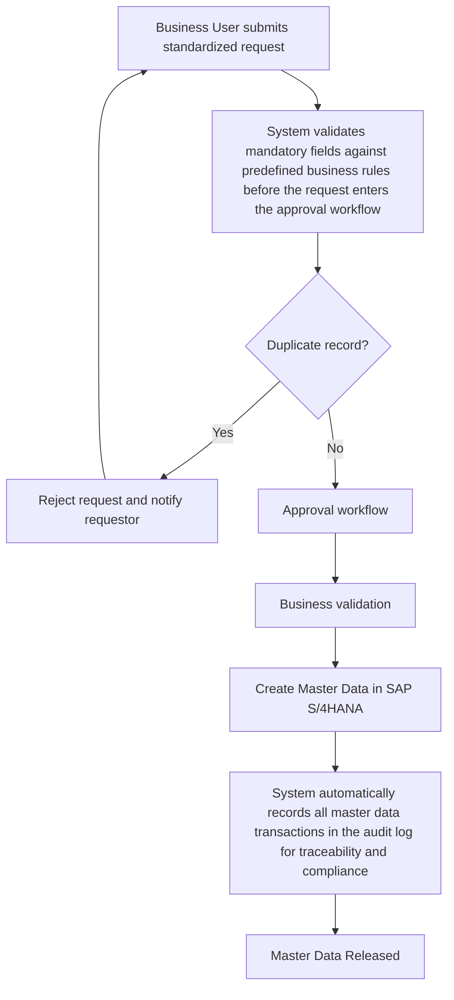

# TO-BE Process Analysis

## 1. Purpose

This document defines the future-state (TO-BE) master data management process for a manufacturing organization. The redesigned process addresses the weaknesses identified in the AS-IS analysis by introducing standardized workflows, data governance controls, automated validation, and clearly defined stakeholder responsibilities.

---

## 2. Process Objectives

The redesigned process aims to:

- Improve master data quality.
- Reduce duplicate records.
- Standardize master data creation.
- Improve process transparency.
- Reduce approval cycle time.
- Support enterprise-wide data governance.
- Improve SAP master data consistency.

---

## 3. Future-State Process Overview

The proposed process introduces standardized request forms, automated validation checks, workflow-based approvals, and governance controls before master data is created within SAP S/4HANA. Every request follows a defined approval workflow and is validated against corporate master data standards before becoming available for operational use.

---

## 4. Process Participants

| Role | Responsibility |
|------|----------------|
| Business User | Initiates master data request |
| Engineering | Provides technical product information |
| Procurement | Validates supplier and material information |
| Data Management Team | Reviews and approves requests |
| Quality | Verifies compliance with data standards |
| IT / SAP Team | Maintains workflow configuration and system support |

---

## 5. Future-State Process Steps

| Step | Activity | Owner |
|-----:|----------|-------|
| 1 | Business user submits standardized request | Business User |
| 2 | Mandatory fields are automatically validated | System |
| 3 | Duplicate record check is performed | System |
| 4 | Request enters approval workflow | Data Management |
| 5 | Business validation completed | Business Owner |
| 6 | Master data created in SAP S/4HANA | Data Management |
| 7 | System records the transaction in the audit log | SAP S/4HANA |
| 8 | System activates the approved master data and makes it available for business use | SAP S/4HANA |

---

## 6. Expected Benefits

- Improved data accuracy.
- Faster processing time.
- Reduced duplicate records.
- Standardized approval workflow.
- Increased process visibility.
- Better regulatory compliance.
- Improved reporting and analytics.

---

## 7. Success Measures

- Reduction in duplicate master data.
- Improved request approval time.
- Increased data quality score.
- Reduced manual corrections.
- Higher stakeholder satisfaction.

---

## 8. Conclusion

The proposed TO-BE process establishes a standardized and governed approach to master data management. The future-state process supports higher data quality, improved operational efficiency, and stronger enterprise data governance while aligning with modern ERP platforms such as SAP S/4HANA.

---

# Appendix A – TO-BE Process Flow

