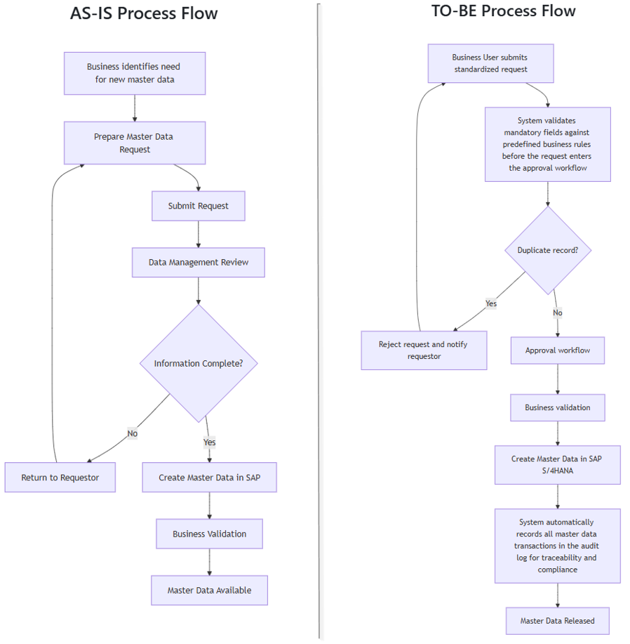

# Business Analysis & Data Management Portfolio for Manufacturing & Engineering

> A practical business analysis and data management portfolio demonstrating how master data governance can improve data quality, business processes, and operational consistency in manufacturing environments.

## Overview


> This portfolio presents practical business analysis and data management projects designed around realistic manufacturing and enterprise environments.

> The projects demonstrate a structured approach to understanding business problems, gathering and documenting requirements, analysing business processes, improving data quality, designing governance frameworks, and supporting implementation through risk management and user acceptance testing.

> The portfolio combines Business Analysis, Data Management, Project Management, and SAP S/4HANA concepts to demonstrate enterprise-style analytical and documentation practices.

## Business Problem

Manufacturing organizations depend on accurate and consistent master data to support procurement, production, inventory, maintenance, logistics, and reporting.

Poor master data quality can lead to:

* Duplicate records
* Incomplete information
* Inconsistent naming conventions
* Process delays
* Reporting inaccuracies
* Increased manual work
* Poor downstream system performance

This project proposes a structured governance framework to address these challenges.

## Business Analysis Approach


<p align="center">
  
</p>

**Key improvement:** The TO-BE process introduces standardized requests,
automated validation, duplicate checking, controlled approval, business
validation, SAP S/4HANA data creation, and audit traceability.


## Skills Demonstrated

* Business Requirements Analysis
* Business Process Analysis and Improvement
* Master Data Governance
* Data Quality Management
* Requirements Engineering
* Stakeholder Management
* Project Management
* Manufacturing Data Management
* Risk Management
* User Acceptance Testing (UAT)
* Project Documentation


---

## Featured Project

### Project 01 - Master Data Governance for Manufacturing

A practical Master Data Governance case study for a manufacturing organization operating within an SAP S/4HANA environment.

The project follows a complete business analysis lifecycle from project initiation and requirements gathering through AS-IS/TO-BE process analysis, governance and data-quality design, risk management, UAT planning, and project closure.

## Key deliverables include:

* Project Charter
* Business Requirements Document (BRD)
* AS-IS Process Analysis
* TO-BE Process Analysis
* Data Dictionary
* Data Quality Rules
* RACI Matrix
* Risk Management
* UAT Test Plan
* Project Documentation
* Final Project Report

[View Project 01](01_Master_Data_Governance/README.md)

[View Complete Project Documentation](01_Master_Data_Governance/docs/README.md)

## Repository Structure


```text
Business_Analysis_Data_Management_Portfolio
│
├── README.md
├── 01_Master_Data_Governance
│   ├── README.md
│   └── docs
│       ├── MDG-P01-001_Project_Charter.md
│       ├── MDG-P01-002_Business_Requirements.md
│       ├── MDG-P01-003_AS-IS_Process.md
│       ├── MDG-P01-004_TO-BE_Process.md
│       ├── MDG-P01-005_Data_Dictionary.md
│       ├── MDG-P01-006_Data_Quality_Rules.md
│       ├── MDG-P01-007_RACI_Matrix.md
│       ├── MDG-P01-008_Risk_Register.md
│       ├── MDG-P01-009_UAT_Test_Plan.md
│       └── MDG-P01-010_Final_Project_Report.md
```


## Project Status


**Status:** ✅ Complete


This repository is being developed as part of a professional Business Analysis \& Data Management portfolio to demonstrate practical skills in master data governance, business process analysis, and project management.


## Author

**Emeka G. Chijioke**

Engineering researcher and professional developing expertise across aerospace engineering, business analysis, data management, engineering systems, and technical project management.
